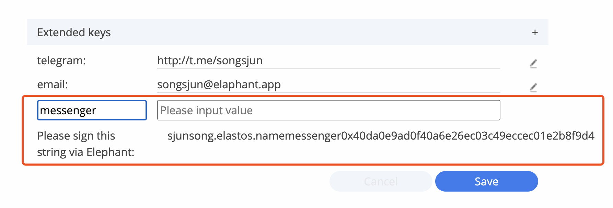
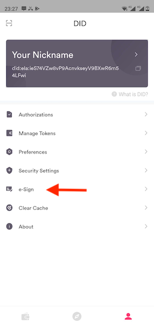
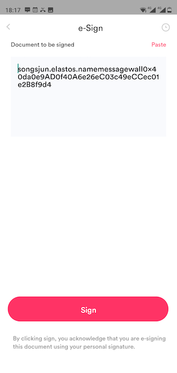
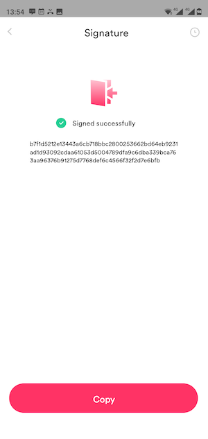
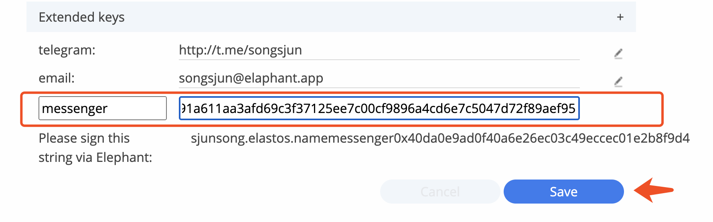
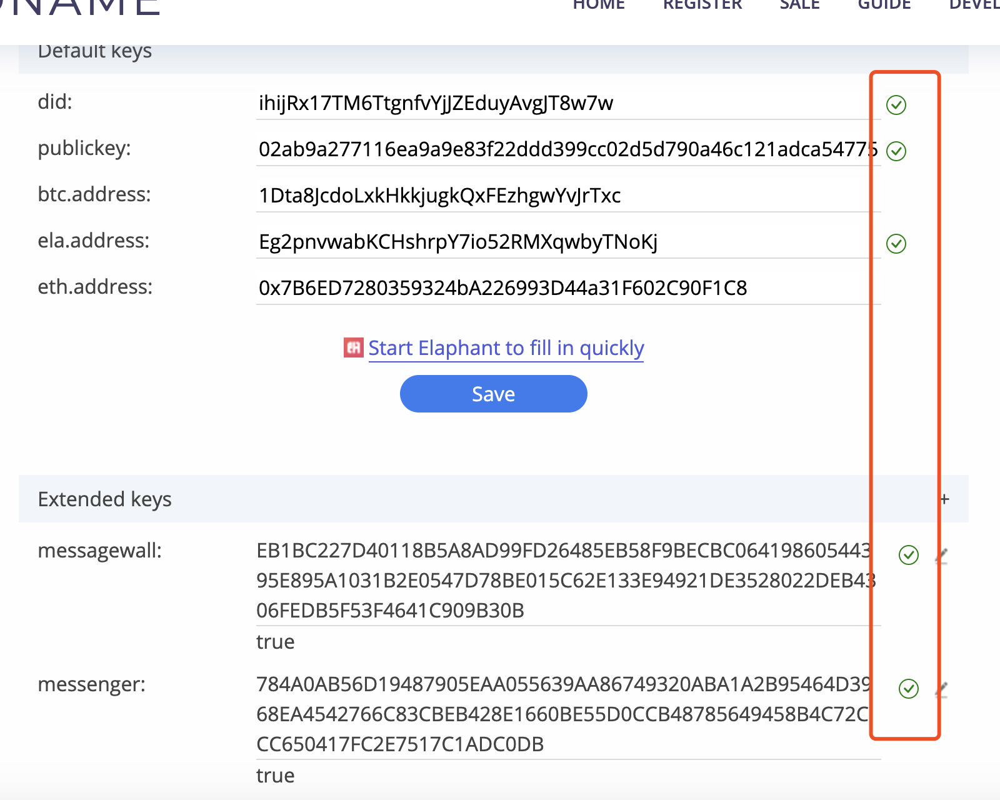
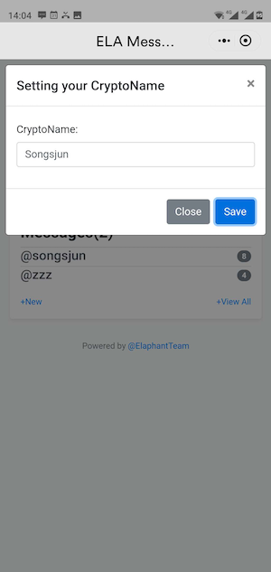
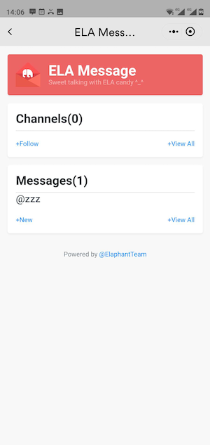
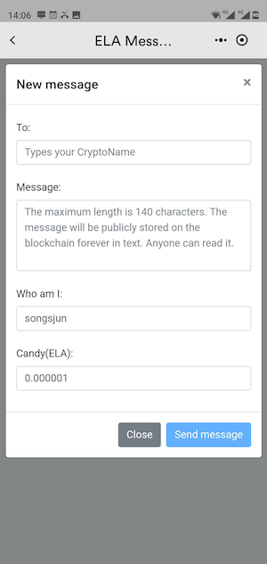
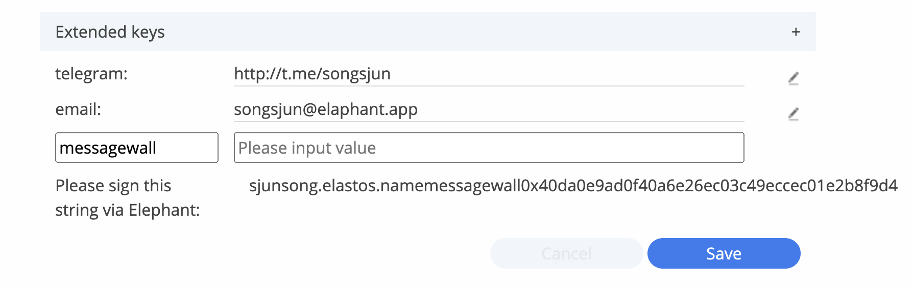

# ELA Messenger Guide

### 1. Enable Messenger of your CryptoName

##### edit your CryptoName, add an extended key that names "messenger"

##### Copy the string and open your Elephant wallet to sign it

##### Paste the signature to the CryptoName and save it.

##### Check your CryptoName info, please confirm all info is right

##### Open ELA Messenger in the Elaphant wallet and type in your CryptoName.

### 2. Install ELA Messenger mini app

Install it from "Mini Apps" or click below URL.

https://launch.elaphant.app/?appName=ELA%20Messenger&appTitle=ELA%20Messenger&autoRedirect=True&redirectURL=elaphant%3A%2F%2Felamessenger.elaphant.app%2Felamessenger.capsule

### 3. Using ELA Messenger

Channel is a message wall, you can post your topic to it.

You can also send a message to your friend who has registered their CryptoName to Messenger.

Enjoy! ^_^

### 4. Enable MessageWall of your CryptoName

##### Same as the step 1, just add an extended key that names "messagewall".

